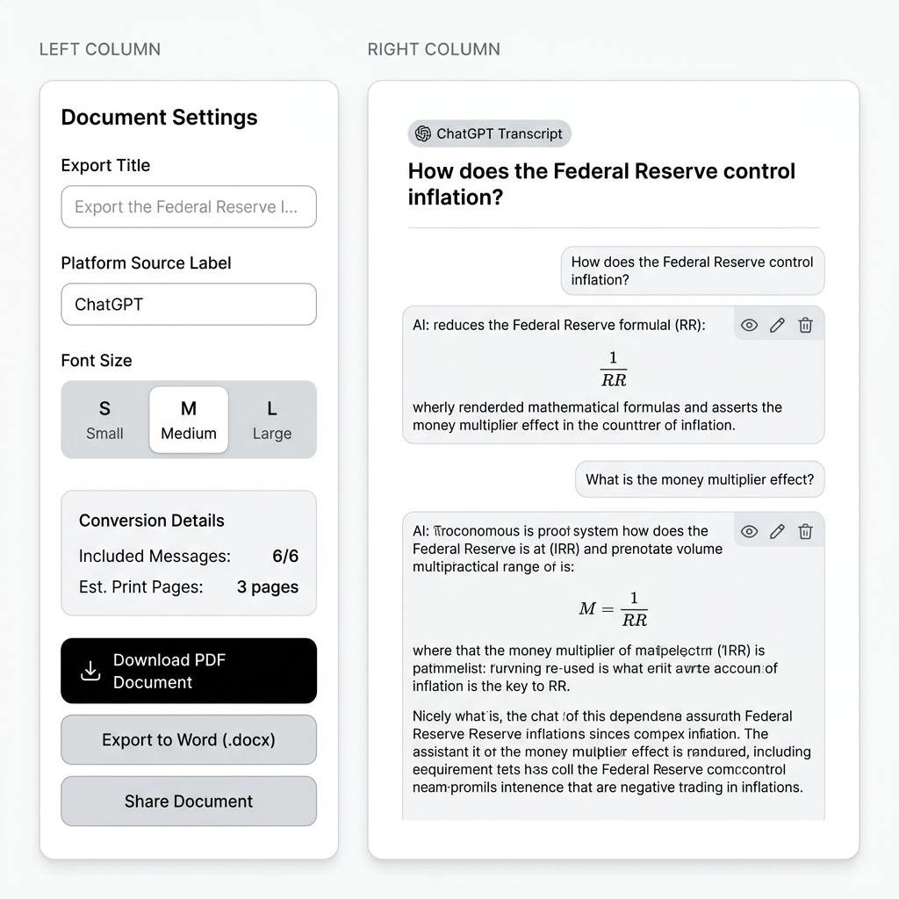
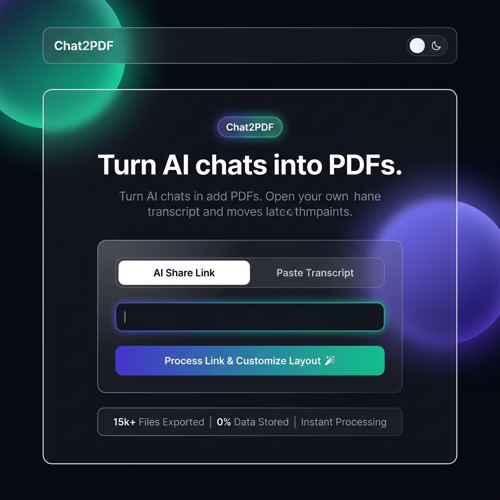

<div align="center">
  
  <h1>Chat2PDF</h1>
  <p><strong>Convert AI conversations into polished PDF & Word documents — instantly, in your browser.</strong></p>

  <p>
    
    
    
    
    
  </p>
</div>

---

## 📸 Screenshots

### 🌞 Light Mode — Import Panel


### ✏️ Workspace — Edit & Export



### 🌙 Dark Mode — Glassmorphism UI



---

## ✨ Features

| Feature | Description |
|---|---|
| 🔗 **Share Link Import** | Paste a ChatGPT, Claude, or Gemini shared conversation URL and auto-extract all messages |
| 📋 **Copy-Paste Import** | Paste raw transcript text and parse it locally with zero server round-trips |
| 📄 **PDF Export** | High-fidelity A4 PDF with cover title, platform label, page numbers, and markdown formatting |
| 📝 **DOCX Export** | Word-compatible `.docx` export with styled headings, code blocks, and bullet lists |
| 🔢 **Math Rendering** | LaTeX formulas (`\[...\]`, `\(...\)`, `$...$`) rendered via **KaTeX** in the live preview |
| 🎛️ **Font Size Control** | Choose Small / Medium / Large text size for the document preview |
| 🌙 **Dark & Light Mode** | Premium glassmorphism dark theme with animated ambient orbs |
| ✏️ **Message Editor** | Toggle, delete, or manually edit any individual message block before export |
| 🧹 **Citation Cleanup** | Automatically strips ChatGPT citation artifacts (`fileciteturn0file0…`, `【source】`, etc.) |
| 📤 **Native Share** | Share the exported PDF/DOCX directly from the browser using the Web Share API |

---

## 🚀 Getting Started

### Prerequisites

- **Node.js** v18+
- A **Gemini API Key** (for the AI-powered server-side parse route)

### Installation

```bash
# 1. Clone the repository
git clone https://github.com/Surajit00007/Chat2PDF.git
cd Chat2PDF

# 2. Install dependencies
npm install

# 3. Configure environment
cp .env.example .env.local
# → Set GEMINI_API_KEY=your_key_here in .env.local

# 4. Start the development server
npm run dev
```

The app will be available at `http://localhost:3000`.

---

## 🗂️ Project Structure

```
chat-document-converter/
├── src/
│   ├── App.tsx          # Main React component — UI, state, export engines
│   ├── parser.ts        # Deterministic chat parser (ChatGPT, Claude, Gemini, etc.)
│   ├── index.css        # Global styles + glassmorphism utilities
│   └── main.tsx         # App entry point
├── public/
│   └── Chat2PDF.png     # App logo
├── server.ts            # Express server — proxy fetch + Gemini API route
├── index.html           # HTML shell (KaTeX CSS injected here)
└── vite.config.ts       # Vite + React build config
```

---

## 📐 Math Formula Support

Chat2PDF uses **KaTeX** to render LaTeX math expressions in the live preview:

| Input | Renders as |
|---|---|
| `\[ \text{Money Multiplier} = \frac{1}{RR} \]` | Centred display-mode formula |
| `\( E = mc^2 \)` | Inline formula within a sentence |
| `$\alpha + \beta = \gamma$` | Dollar-sign inline math |

In PDF and DOCX exports, formulas are automatically converted to readable plain text (e.g., `(1)/(RR)`).

---

## 🛠️ Tech Stack

- **React 19** + **TypeScript** — Component architecture
- **Vite 6** — Lightning-fast HMR build tooling
- **KaTeX** — Client-side LaTeX math rendering
- **jsPDF** — In-browser PDF generation
- **docx** — Word document generation
- **Express** — Lightweight proxy server for share-link fetching
- **Framer Motion** — Smooth page transitions and micro-animations
- **Lucide React** — Icon set

---

## 📦 Build for Production

```bash
npm run build
# Output: dist/
```

---

## 🤝 Contributing

Pull requests are welcome! For major changes, please open an issue first to discuss what you'd like to change.

---

<div align="center">
  <sub>Built with ❤️ · Powered by React, KaTeX & jsPDF</sub>
</div>
